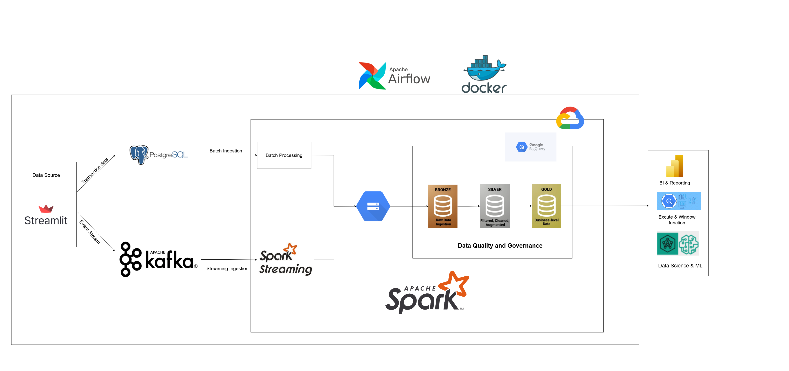

# 🛒 End-to-End E-Commerce Data Lakehouse (Medallion Architecture)



## 📌 Project Overview
This project demonstrates a robust, enterprise-grade End-to-End Data Engineering pipeline for an E-commerce platform. It seamlessly integrates **Real-time Streaming** and **Batch Processing** to ingest, process, and serve data using the **Medallion Data Lakehouse Architecture (Bronze -> Silver -> Gold)** on Google BigQuery.

## 🛠️ Tech Stack
* **Data Generation & Web UI:** Python, Streamlit
* **Operational Database:** PostgreSQL
* **Message Broker:** Apache Kafka, Zookeeper
* **Data Processing:** Apache Spark (Structured Streaming & Batch)
* **Orchestration:** Apache Airflow
* **Cloud Storage & Data Warehouse:** Google Cloud Storage (GCS), Google BigQuery
* **Containerization:** Docker, Docker Compose
* **Data Visualization:** Power BI

## 🌟 Key Features
1. **Medallion Architecture:** Strict data governance routing data through `Bronze` (Raw), `Silver` (Cleaned & Validated), and `Gold` (Business-ready Star Schema) layers.
2. **Lambda Architecture Support:** * **Real-time Pipeline:** Spark Structured Streaming processes live user events (page views, cart updates, checkouts) from Kafka via micro-batches, writing to BigQuery using the `foreachBatch` mechanism and `Avro` intermediate format.
   * **Batch Pipeline:** Airflow orchestrates daily jobs to snapshot operational data (Postgres) and perform complex denormalization.
3. **Data Quality & Quarantine:** Built-in validation rules drop or route bad records (null keys, negative prices) to a `quarantine_events` table in the Silver layer.
4. **Mock Traffic Generator:** A fully functional Streamlit E-commerce front-end that generates realistic user journeys, shopping carts, and checkout behaviors.

## 🚀 How to Run Locally

### 1. Prerequisites
* Docker & Docker Compose installed.
* A Google Cloud Platform (GCP) project with BigQuery and GCS enabled.
* A GCP Service Account JSON key.

### 2. Setup
Clone the repository and place your GCP service account key:
```bash
git clone [https://github.com/lenguyenkhoi/End-to-End-E-Commerce-Data-Lakehouse.git](https://github.com/lenguyenkhoi/End-to-End-E-Commerce-Data-Lakehouse.git)
cd End-to-End-E-Commerce-Data-Lakehouse
# Place your GCP key at: 3_spark_processing/config/gcp_service_account.json
# Update the GCS_TEMP_BUCKET and GCP_PROJECT variables inside spark_streaming.py and spark_batch.py with your actual GCP details.
```

### 3. Start the Infrastructure
```bash
docker compose up -d --build
```

### 4. Access the Services
**E-commerce Web App (Traffic Simulator):** http://localhost:8501

**Kafka UI:** http://localhost:8090

**Apache Airflow:** http://localhost:8080 (Trigger the ecommerce_medallion_batch DAG)

